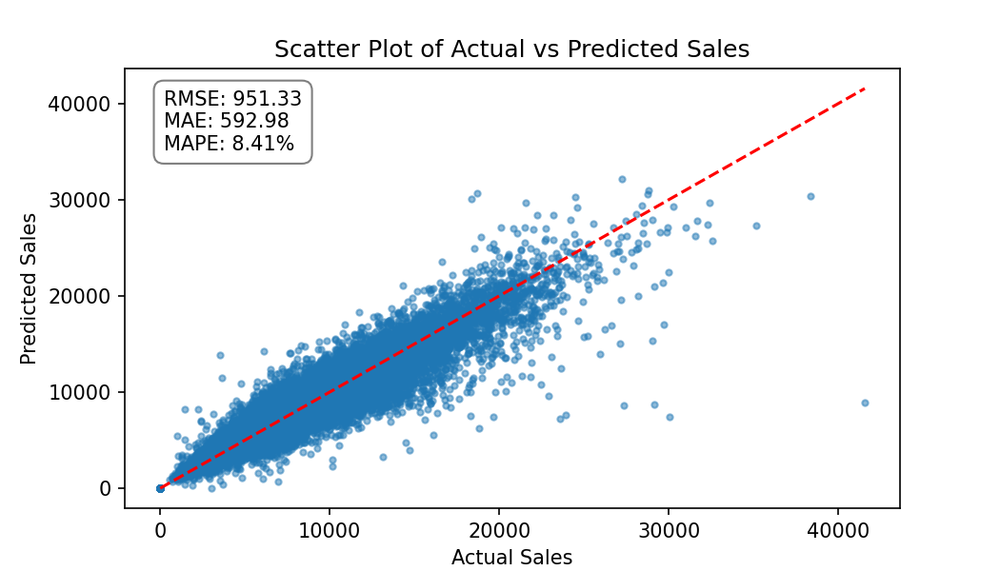
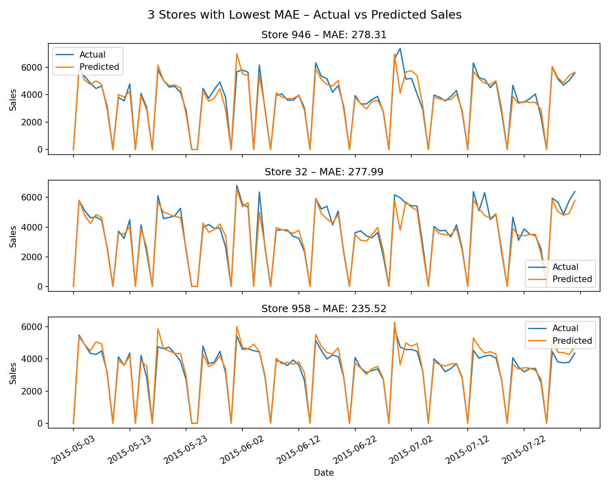
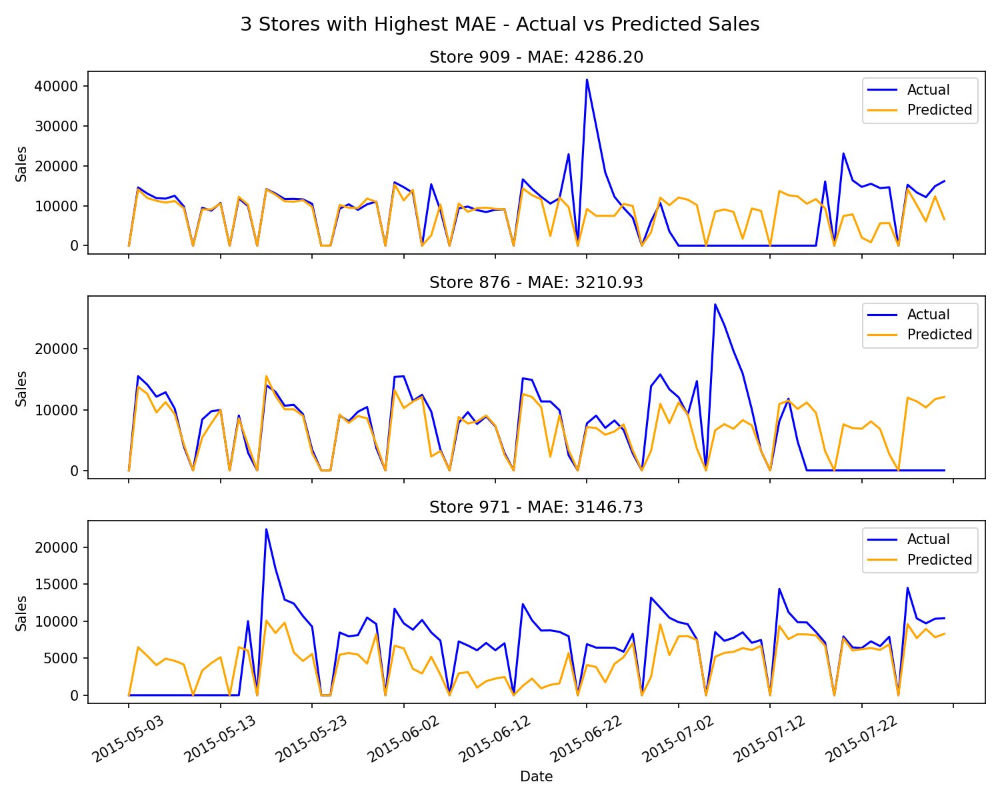

# Rossmann Store Sales Forecasting

Predicting daily sales for 1,000+ Rossmann drugstores using historical sales, promotional data, and store metadata.

---

## Overview

This repository contains an end-to-end Machine Learning pipeline trained on [Kaggle's Rossmann Store Sales](https://www.kaggle.com/c/rossmann-store-sales) dataset.

The model is an XGBoost regressor tuned via nested time-series cross-validation. Hyperparameter search is driven by Optuna using a TPE sampler with a Median pruner to cut unpromising trials early. Each trial is evaluated inside an inner time-series CV loop; per-fold XGBoost boosters and CV histories are checkpointed to disk so runs are resumable. The best hyperparameters from each outer fold are used to retrain a final model on the full outer training window.

---

## Results Summary

The model was evaluated on a held-out validation set covering ~1,115 stores across multiple weeks. Performance metrics:

| Metric | Value |
|--------|-------|
| RMSE | 1,695.60 |
| MAE | 805.77 |
| MAPE (excl. zero-sales days) | 12.92% |

Predictions track actual sales closely across the full range, with larger absolute errors concentrated in high-volume stores.



The stores with the lowest prediction error tend to have stable, lower-volume sales patterns, while the highest-error stores are typically high-volume with more volatile demand.



The hardest stores to predict are stores 909, 876, and 971, with MAEs of 4,286, 3,211, and 3,147 respectively — roughly 4–5× the average. These stores show large, irregular sales spikes that the model consistently under-predicts, or prolonged zero-sales periods (perhaps temporarily closed).



---

## Quick Start

1. **Clone & Install:**
   ```bash
   git clone [https://github.com/your-username/rossmann-sales-forecasting.git](https://github.com/your-username/rossmann-sales-forecasting.git)
   cd rossmann-sales-forecasting
   pip install -r requirements.txt